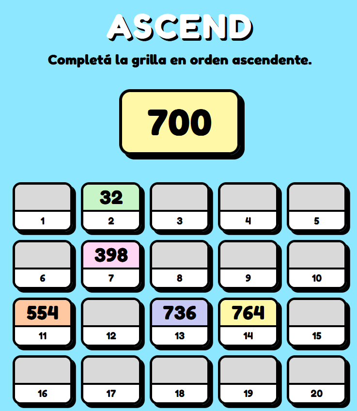

# ASCEND

Completá la grilla en orden ascendente. Sin espacio para errores.



---

## Cómo se juega

Cada turno se genera un número aleatorio entre 1 y 999. Tu objetivo es arrastrarlo a uno de los 20 casilleros disponibles, de forma que la grilla quede ordenada de menor a mayor de arriba a abajo.

- ✅ Podés colocar el número en cualquier casillero vacío, siempre que todos los números anteriores sean menores y todos los posteriores sean mayores.
- 💀 Si se genera un número que no puede colocarse en ningún casillero disponible, perdés.
- 🏆 Si lográs llenar los 20 casilleros, ganás.

---

## Stack

- React + Vite
- [@dnd-kit](https://dndkit.com/) para el drag & drop (compatible con mouse y pantalla táctil)
- CSS puro
- Desplegado en Vercel

---

## Correrlo localmente

```bash
git clone https://github.com/ignamosconi/order-game
cd order-game
npm install
npm run dev
```

Abrí `http://localhost:5173` en el navegador.

Para acceder desde el celular en la misma red:

```bash
npm run dev -- --host
```

Y abrí la URL de `Network` que aparece en la terminal.